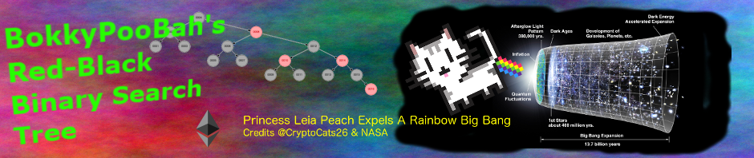
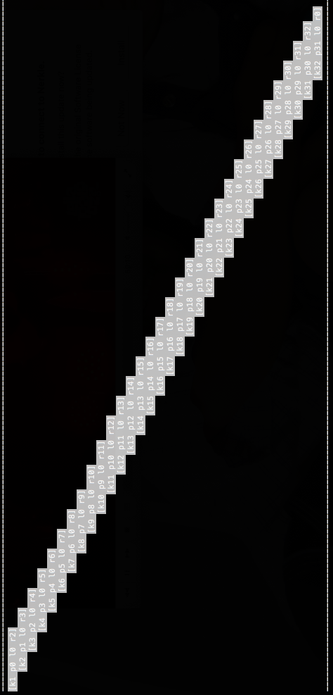
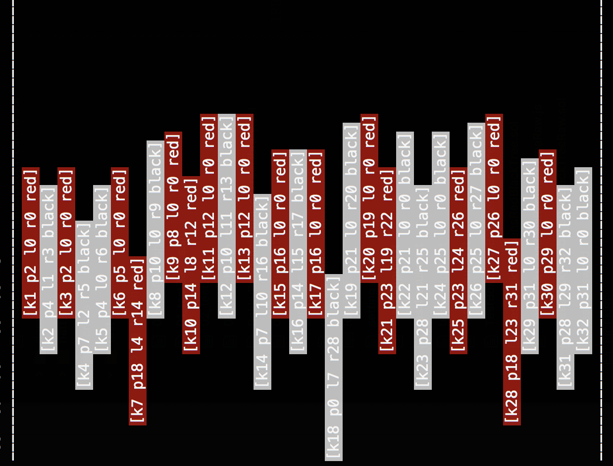
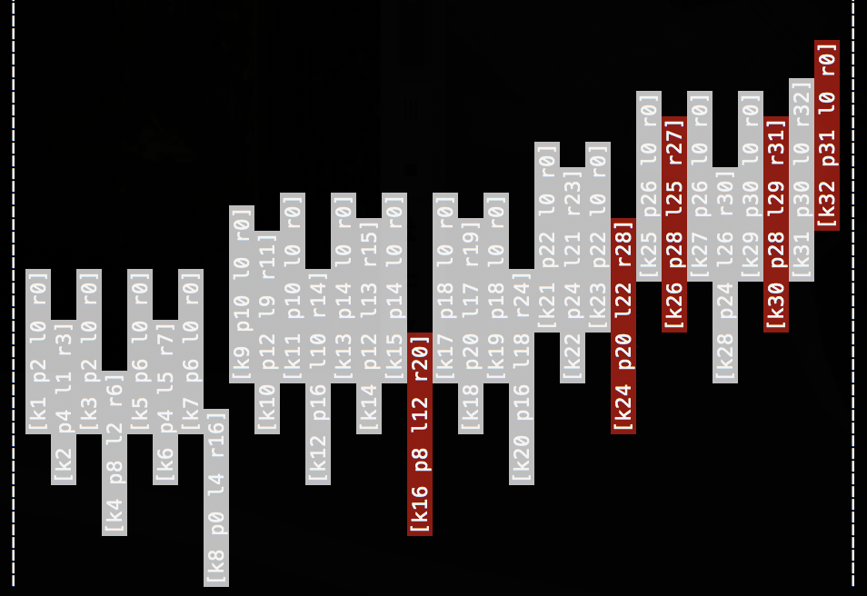
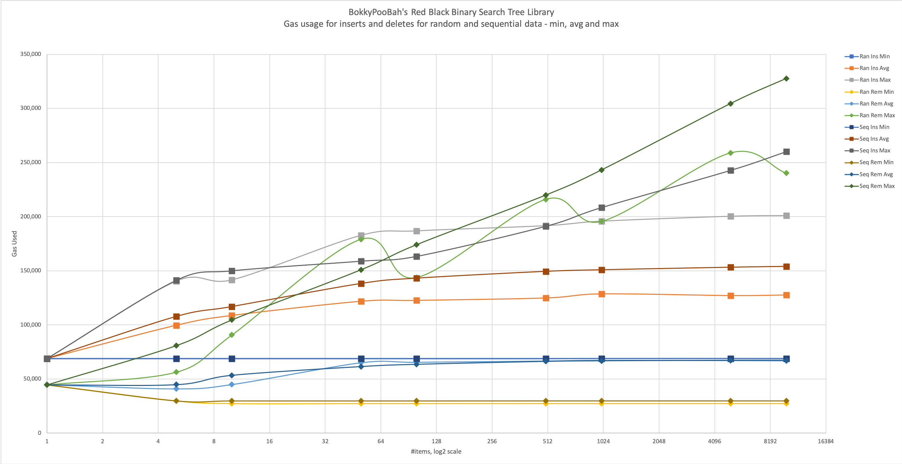

<kbd></kbd>

<br />

<hr />

# BokkyPooBahs Red-Black Binary Search Tree Library

Status: **Currently being tested and bug bounty open. Don't use in production without an audit, yet.**

A gas-efficient Solidity library using the iterative (rather than recursive) Red-Black binary search tree algorithm to help you maintain a sorted `uint` key index for your data. Insertions, deletions and searches are in **O(log n)** time (and ~gas). Note that the key of 0 is prohibited. Use the sorted keys as indices to your mapping tables of data to access your data in sorted order.

Inserting a key into an empty tree costs 68,459 gas. Inserting a key into a tree with 9,999 keys costs 127,210 gas on average. Removing an element from a tree with a single key costs 44,835 gas. Removing a key from a tree with 10,000 keys cost 81,486 gas on average.

An important use-case for this library is to maintain a sorted on-chain order book in decentralised exchange smart contracts, providing a provably fair order matching algorithm.

<br />

<hr />

## Table Of Contents

* [Overview](#overview)
  * [Binary Search Tree](#binary-search-tree)
  * [Red-Black Binary Search Tree](#red-black-binary-search-tree)
  * [Red-Black Tree With Random Insertion](#red-black-tree-with-random-insertion)
  * [Red-Black Tree With Sequential Insertion](#red-black-tree-with-sequential-insertion)
  * [Gas Cost](#gas-cost)
    * [Random Insertion Gas Cost](#random-insertion-gas-cost)
    * [Sequential Insertion Gas Cost](#sequential-insertion-gas-cost)
* [History](#history)
* [Bug Bounty Scope And Donations](#bug-bounty-scope-and-donations)
* [Deployment](#deployment)
* [Questions And Answers](#questions-and-answers)
* [Functions](#functions)
  * [root](#root)
  * [first](#first)
  * [last](#last)
  * [next](#next)
  * [prev](#prev)
  * [exists](#exists)
  * [getNode](#getnode)
  * [insert](#insert)
  * [remove](#remove)
* [Testing](#testing)
* [References](#references)

<br />

<hr />

## Overview

### Binary Search Tree

The [Red-Black Tree](https://en.wikipedia.org/wiki/Red%E2%80%93black_tree) binary search tree is a self-rebalancing [binary search tree](https://en.wikipedia.org/wiki/Binary_search_tree). Following is a diagram of a fairly well-balanced binary search tree.

<kbd></kbd>

The following unbalanced binary search tree was generated by inserting the numbers 1 to 32 in sequential order `[1,2,3,4,5,6,7,8,9,10,11,12,13,14,15,16,17,18,19,20,21,22,23,24,25,26,27,28,29,30,31,32]`:

<kbd></kbd>

Inserting the keys into the binary search tree in sequential order will result in this unbalanced tree resembling a linked-list.

<br />

### Red-Black Binary Search Tree

The red-black algorithm maintains a red or black colouring for each node in the tree, and uses this information to maintain a reasonably balanced tree. From [Wikipedia](https://en.wikipedia.org/wiki/Red%E2%80%93black_tree):

> In addition to the requirements imposed on a binary search tree the following must be satisfied by a red–black tree:
>
> * Each node is either red or black.
> * The root is black. This rule is sometimes omitted. Since the root can always be changed from red to black, but not necessarily vice versa, this rule has little effect on analysis.
> * All leaves (NIL) are black.
> * If a node is red, then both its children are black.
> * Every path from a given node to any of its descendant NIL nodes contains the same number of black nodes.

When an element is inserted into or removed from a red-black tree, the binary search tree is rebalanced to satisfy the red-black rules.

From Wikipedia's [Red-Black Tree](https://en.wikipedia.org/wiki/Red%E2%80%93black_tree) page, the following Red-Black tree was created by inserting the items `[13,8,17,11,15,22,25,27,1,6]`:

<kbd></kbd>

<br />

### Red-Black Tree With Random Insertion

The following fairly well-balanced red-black tree was generated by inserting the numbers 1 to 32 in random order `[15,14,20,3,7,10,11,16,18,2,4,5,8,19,1,9,12,6,17,13]`:

<kbd></kbd>

The root node of the tree is 18, `k` represents the key numbers, `p` the parent, `l` the left node, `r` the right node. Nodes with `l0 r0` are the leaves of the tree.

<br />

### Red-Black Tree With Sequential Insertion

The following red-black tree was generated by inserting the numbers 1 to 32 in sequential order `[1,2,3,4,5,6,7,8,9,10,11,12,13,14,15,16,17,18,19,20,21,22,23,24,25,26,27,28,29,30,31,32]`:

<kbd></kbd>

A property of the red-black tree is that the path from the root to the farthest leaf is no more than twice as long as the path from the root to the nearest leaf. The shortest path has all black nodes and the longest path alternate between red and black nodes.

The shortest path is 4 levels deep: (8 black), (4 black), (2 black), (1 black).

The longest path is 8 levels deep: (8 black), (16 red), (20 black), (24 red), (28 black), (30 red), (31 black), (32 red). This is no more than twice as long as the shortest path.


<br />

<hr />

### Gas Cost

Following is a chart with the minimum, average and maximum gas cost for insertions and deletions from a Red-Black Tree. The result have been generated by insering random data in the first case, and sequential data in the second case.

<kbd></kbd>

Data and chart - [docs/GasStatistics.xlsx](docs/GasStatistics.xlsx).

<br />

#### Random Insertion Gas Cost

The following table shows the minimum, average and maximum gas cost for the insertion of items in a **random** order and removal of items from a red-black tree:

Items  | Ins Min | Ins Avg | Ins Max | Rem Min | Rem Avg | Rem Max
------:| -------:| -------:| -------:| -------:| -------:| -------:
1      | 68,913  |  68,913 |  68,913 | 44,654  | 44,654  |  44,654
5      | 68,913  |  99,588 | 140,404 | 29,827  | 40,891  |  56,405
10     | 68,913  | 108,635 | 141,518 | 27,375  | 44,880  |  90,688
50     | 68,913  | 121,753 | 182,645 | 27,375  | 64,977  | 179,109
100    | 68,913  | 122,549 | 186,766 | 27,375  | 65,447  | 143,832
500    | 68,913  | 124,790 | 191,559 | 27,375  | 66,629  | 215,994
1,000  | 68,977  | 128,550 | 195,719 | 27,375  | 67,331  | 195,574
5,000  | 68,977  | 127,029 | 200,233 | 27,375  | 66,966  | 258,858
10,000 | 68,977  | 127,516 | 200,907 | 27,375  | 66,781  | 240,152

Note that the statistics above will change with each execution, as the data inserted is randomised.

<br />

#### Sequential Insertion Gas Cost

The following table shows the minimum, average and maximum gas cost for the insertion of items in a **sequential** order and removal of items from a red-black tree:

Items  | Ins Min | Ins Avg  | Ins Max | Rem Min | Rem Avg | Rem Max
------:| -------:| --------:| -------:| -------:| -------:| -------:
1      | 68,913   | 68,913  | 68,913  | 44,654  | 44,654  | 44,654
5      | 68,913   | 107,761 | 141,129 | 29,827  | 44,883  | 80,922
10     | 68,913   | 116,896 | 149,938 | 29,827  | 53,457  | 104,650
50     | 68,913   | 138,234 | 158,844 | 29,827  | 61,485  | 151,002
100    | 68,913   | 143,145 | 163,297 | 29,827  | 63,540  | 174,178
500    | 68,913   | 149,417 | 191,134 | 29,859  | 66,239  | 219,978
1,000  | 68,913   | 150,878 | 208,360 | 29,859  | 66,774  | 243,154
5,000  | 68,913   | 153,219 | 242,813 | 29,859  | 67,276  | 304,485
10,000 | 68,913   | 154,017 | 260,040 | 29,859  | 67,352  | 327,661

<br />

<hr />

## History

Version             | Date         | Notes
:------------------ |:------------ |:---------------------------------------
v0.90-pre-release   | Feb 17 2019  | Bug bounty added
v1.0 pre-release-a  | Feb 25 2019  | Incorporated [suggestions](https://github.com/bokkypoobah/BokkyPooBahsRedBlackTreeLibrary/pull/1) from [Rob Hitchens](https://github.com/rob-Hitchens)

<br />

<hr />

## Bug Bounty Scope And Donations

Details of the bug bounty program for this project can be found at [BokkyPooBah's Hall Of Fame And Bug Bounties](https://github.com/bokkypoobah/BokkyPooBahsHallOfFameAndBugBounties). Please consider [donating](https://github.com/bokkypoobah/BokkyPooBahsHallOfFameAndBugBounties#donations) to support the bug bounty, and the development and maintenance of decentralised applications.

The scope of the bug bounty for this project follows:

* [contracts/BokkyPoobahsRedBlackTreeLibrary.sol](contracts/BokkyPoobahsRedBlackTreeLibrary.sol)

<br />

Bounties awarded for this project:

* Feb 25 2018 - [Rob Hitchens](https://github.com/rob-Hitchens) submitted a [set of performance and readability improvements](https://github.com/bokkypoobah/BokkyPooBahsRedBlackTreeLibrary/pull/1) to this library.

<br />

<hr />

## Deployment

This library has been designed to be automatically compiled into your Ethereum Solidity contract or library, instead of having to deploy this library and then linking your contract or library to this library.

<br />

<hr />

## Questions And Answers

### What would I use this library for?

Any smart contract where you need to maintain a sorted list of unsigned integers. One major use case is for this RBT library to maintain a decentralised exchange orderbook, sorted by price.

<br />

### Why does this library only store unsigned integers and not any additional data?

This library was designed to be a simple component to be used within your smart contract project.

Store any additional data, e.g., key/value pairs, by adding the functionality into your smart contract. Sample code from [contracts/TestBokkyPoobahsRedBlackTree.sol](contracts/TestBokkyPoobahsRedBlackTree.sol) follows:

```javascript
contract TestBokkyPooBahsRedBlackTree {
    using BokkyPooBahsRedBlackTreeLibrary for BokkyPooBahsRedBlackTreeLibrary.Tree;

    BokkyPooBahsRedBlackTreeLibrary.Tree tree;
    mapping(uint => uint) values;

    event Log(string where, uint key, uint value);

    ...

    function getNode(uint _key) public view returns (uint key, uint parent, uint left, uint right, bool red, uint value) {
        if (tree.exists(_key)) {
            BokkyPooBahsRedBlackTreeLibrary.Node memory node = tree.getNode(_key);
            (key, parent, left, right, red) = (_key, node.parent, node.left, node.right, node.red);
            value = values[_key];
        }
    }

    function insert(uint _key, uint _value) public {
        tree.insert(_key);
        values[_key] = _value;
        emit Log("insert", _key, _value);
    }
    function remove(uint _key) public {
        tree.remove(_key);
        emit Log("remove", _key, values[_key]);
        delete values[_key];
    }
}
```

<br />

### Can duplicate entries be inserted?

No

<br />

<hr />

## Functions

See [contracts/TestBokkyPooBahsRedBlackTree.sol](contracts/TestBokkyPooBahsRedBlackTree.sol) (or the [flattened](flattened/TestBokkyPooBahsRedBlackTree_flattened.sol) version) for an example contract that uses this library.

Notes:

* The function parameter `Tree storage self` has been omitted in the documentation below, as Solidity automatically injects the library data structure in place of this first parameter
* There is a constant `EMPTY` that is set to 0 in the library source code by default
* The `insert(...)` and `remove(...)` functions have `internal` visibility so it is easy to deploy your contract, as these function calls will be inlined. There may be cases where you may want to specify a `public` visibility so the is not inlined and duplicated in the deployment EVM code.

<br />

### root
```javascript
function root() internal view returns (uint _key);
```

Returns the root of the tree, or `EMPTY` is the tree is empty.

<br />

### first

```javascript
function first() internal view returns (uint _key);
```

Returns the smallest key in the tree.

Return Value  | Condition
:------------ |:--------
_{first key}_ | Tree has at least one key
`EMPTY`       | Tree empty

<br />

### last

```javascript
function last() internal view returns (uint _key);
```

Returns the largest key in the tree.

Return Value | Condition
:----------- |:--------
_{last key}_ | Tree has at least one key
`EMPTY`      | Tree empty

<br />

### next

```javascript
function next(uint x) internal view returns (uint y);
```

Returns the next key in the tree with a value larger than `x`.

Return Value | Condition
:----------- |:--------
_{next key}_ | There exists a key with a value larger than the `x` key
`EMPTY`      | Tree empty
`EMPTY`      | `x` is not an existing key in the tree
`EMPTY`      | `x` is the only key in the tree
`EMPTY`      | `x` is the last key in the tree

<br />

### prev

```javascript
function prev(uint x) internal view returns (uint y);
```

Returns the previous key in the tree with a value smaller than `x`.

Return Value | Condition
:----------- |:--------
_{prev key}_ | There exists a key with a value smaller than the `x` key
`EMPTY`      | Tree empty
`EMPTY`      | `x` is not an existing key in the tree
`EMPTY`      | `x` is the only element in the tree
`EMPTY`      | `x` is the last element in the tree

<br />

### exists

```javascript
function exists(uint key) internal view returns (bool _exists);
```

Returns _true_ if the key exists in the tree, _false_ otherwise.

Return Value | Condition
:----------- |:--------
_true_       | `key` is an existing key in the tree
_false_      | Tree empty
_false_      | `key` is not an existing key in the tree

<br />

### isEmpty

```javascript
function isEmpty(uint key) internal pure returns (bool);
```

Returns _true_ if the key exists in the tree, _false_ otherwise.

Return Value | Condition
:----------- |:--------
_true_       | `key` is an existing key in the tree
_false_      | Tree empty
_false_      | `key` is not an existing key in the tree

<br />

### getEmpty

```javascript
function getEmpty() internal pure returns (uint);
```

Returns the value of the EMPTY variable

<br />

### getNode

```javascript
function getNode(uint key) internal view returns (uint _returnKey, uint _parent, uint _left, uint _right, bool _red);
```

Returns the node information if `key` exists in the tree. All `uint` values will be set to `EMPTY` if `key` does not exist in the tree.

<br />

### insert

```javascript
function insert(uint key) internal;
```

Insert the key `key` into the tree.

Transaction | Condition
:---------- |:--------
_success_   | `key` has been successfully inserted into the tree
_failure_   | `key` already exists in the tree

<br />

### remove

```javascript
function remove(uint key) internal;
```

Remove the key `key` from the tree.

Transaction | Condition
:---------- |:--------
_success_   | `key` has been successfully removed from the tree
_failure_   | `key` does not exist in the tree

<br />

<hr />

## Algorithm

The main Red-Black binary search tree algorithm is listed in [Algorithms for Red Black Tree Operations
(from CLRS text)](http://www.cse.yorku.ca/~aaw/Sotirios/RedBlackTreeAlgorithm.html).

Note that this algorithm is designed to work with memory pointers to the node data. The rebalancing process after the removal of an item from the tree may result in a swapping of data values between nodes.


As the nodes are stored as elements in a Solidity *mapping* data structure, [Iterative Algorithm for Red-Black Tree](https://stackoverflow.com/a/11328289) provides an alternative algorithm to perform this swapping. In particular, the function `RB-Delete` in the main Red-Black algorithm will need the line `then key[z] := key[y]` replaced with the alternative swapping algorithm.

<br />

<hr />

## Testing

* [x] Test random insertions and deletions of 1, 10, 100, 1000 and 10000 keys
* [x] Test the insert function, including inserting a duplicate key
* [x] Test the `remove` function, including removing a non-existent key
* [x] Test the `view` functions, including what happens when a non-existent key is passed
* [x] Test sequential insertions
* [ ] Test repeated random insertions and deletions

<br />

<hr />

## References

* [Red-black tree visualization](https://www.cs.usfca.edu/~galles/visualization/RedBlack.html)
* [Red–black tree](https://en.wikipedia.org/wiki/Red%E2%80%93black_tree) - Wikipedia
* [Algorithms for Red Black Tree Operations](http://www.cse.yorku.ca/~aaw/Sotirios/RedBlackTreeAlgorithm.html) - from *Introduction to Algorithms* by Cormen, Leiserson, Rivest and Stein.
* [Iterative Algorithm for Red-Black Tree](https://stackoverflow.com/questions/3758356/iterative-algorithm-for-red-black-tree)
* [Laboratory Module 6 - Red-Black Trees](http://software.ucv.ro/~mburicea/lab8ASD.pdf) - Mihail Buricea. A copy has been saved to [docs/lab8ASD.pdf](docs/lab8ASD.pdf)
* https://www.cs.dartmouth.edu/~thc/cs10/lectures/0519/0519.html
  * https://www.cs.dartmouth.edu/~thc/cs10/lectures/0519/RBTree.java
* https://www.csee.umbc.edu/courses/undergraduate/341/fall13/section3/lectures/10-Red-Black-Trees.pdf
* http://cseweb.ucsd.edu/~kube/cls/100/Lectures/lec7/lec7.pdf
* https://www.geeksforgeeks.org/red-black-tree-set-1-introduction-2/

<br />

<br />

Thanks to [James Zaki](https://github.com/jzaki) and [Solidified](https://solidified.io/) for the 3 minor issues they picked up at the Web3 Summit.

And thanks to [Rob Hitchens](https://github.com/rob-Hitchens) for the [suggestions](https://github.com/bokkypoobah/BokkyPooBahsRedBlackTreeLibrary/pull/1).


Enjoy!

(c) BokkyPooBah / Bok Consulting Pty Ltd - Feb 26 2018. The MIT Licence.
